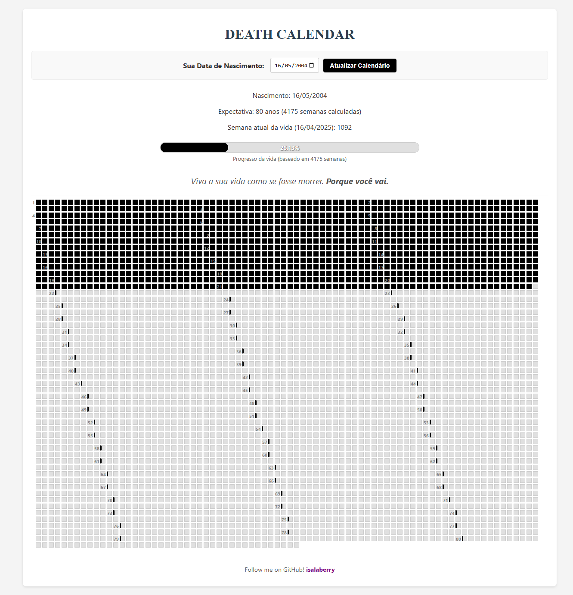

# 💀 Death Calendar 💀

**Visualize as Semanas da Sua Vida**

[](https://death-calendar-three.vercel.app/)
<p align="center"><em>(Clique na imagem para ver a demo!)</em></p>

---

🚀 **Demo Online:** [**death-calendar-three.vercel.app**](https://death-calendar-three.vercel.app/) 🚀

---

## 📜 Conceito

Memento Mori. Lembre-se da Morte. O Death Calendar serve esse único propósito sombrio. Forneça a data em que foi lançado neste mundo, e veja o calendário da sua própria obsolescência: 80 anos, semana a semana, cada quadrado um passo para mais perto do fim.

Pinte de negro as semanas que o tempo já devorou. Observe a barra de progresso como o nível a subir num caixão iminente. Não há aqui otimismo, apenas a constatação brutal da finitude. Sinta a náusea Sartriana ao perceber que cada ação, cada semana marcada, talvez não passe de um gesto fútil perante o silêncio cósmico e a inevitabilidade do nada. Encare de frente o espectro do "pouco tempo", a vacuidade do sentido e a sua própria, transitória, inutilidade!

<br>
> Viva a sua vida como se fosse morrer.  
> **Porque você vai.**
<br>

## ✨ Funcionalidades

* **Grelha de Semanas Personalizada:** Insira a sua data de nascimento para gerar um calendário único.
* **Visualização Clara:** Cada quadrado representa uma semana (aprox. 4175 semanas para 80 anos).
* **Marcação Interativa:** Clique para marcar/desmarcar semanas individuais.
* **Persistência:** O estado das suas semanas marcadas é guardado no `localStorage` do seu navegador, específico para cada data de nascimento inserida.
* **Preenchimento Automático:** Ao inserir/atualizar a data de nascimento, as semanas passadas até à data atual são preenchidas automaticamente (se não houver dados guardados para essa data).
* **Marcadores de Ano:** Uma indicação visual (borda e número opcional) marca o início de cada novo ano de vida na grelha.
* **Barra de Progresso:** Veja visualmente a percentagem de semanas já vividas em relação ao total esperado.
* **Cálculo Preciso:** Leva em conta anos bissextos para calcular o número total de semanas.

## 💻 Tecnologias Utilizadas

* [React](https://reactjs.org/) (v19)
* [Vite](https://vitejs.dev/)
* JavaScript
* CSS

## 🚀 Como Usar Online

Basta aceder ao link da demo: [**death-calendar-three.vercel.app**](https://death-calendar-three.vercel.app/)

1.  Insira a sua data de nascimento no campo indicado.
2.  Clique em "Atualizar Calendário".
3.  Explore a grelha e clique nas semanas para as marcar!

## ⚙️ Executar Localmente

Se quiser executar o projeto na sua máquina:

1.  **Clone o Repositório:**
    ```bash
    git clone <https://github.com/isalaberry/DeathCalendar.git>
    cd semanas-da-minha-vida
    ```
2.  **Instale as Dependências:**
    ```bash
    npm install
    ```
3.  **Inicie o Servidor de Desenvolvimento:**
    ```bash
    npm run dev
    ```
4.  Abra o seu navegador e aceda a `http://localhost:5173` (ou o URL fornecido).

## 🛠️ Comando de Build

Para gerar os ficheiros otimizados para produção (que são usados no deployment):

```bash
npm run build